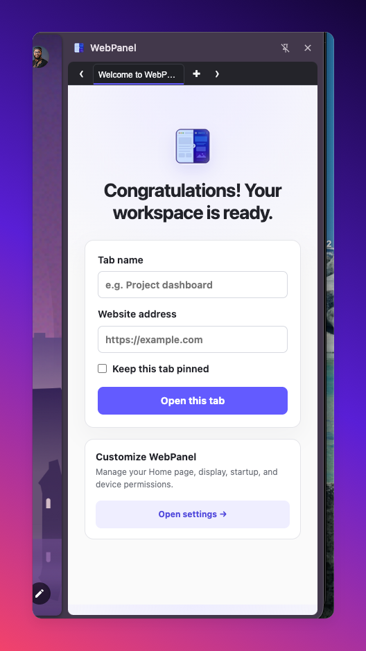
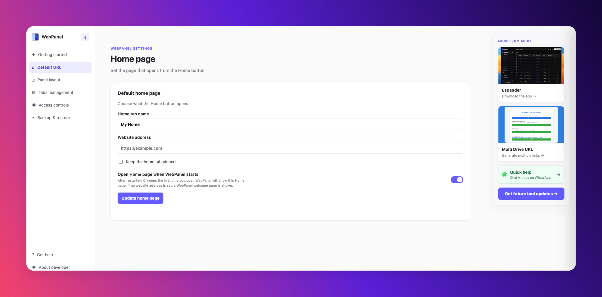
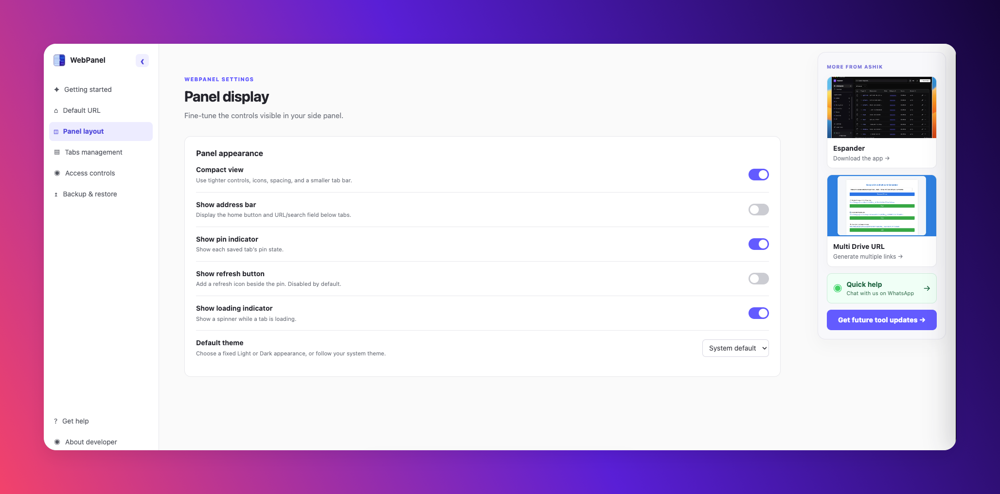
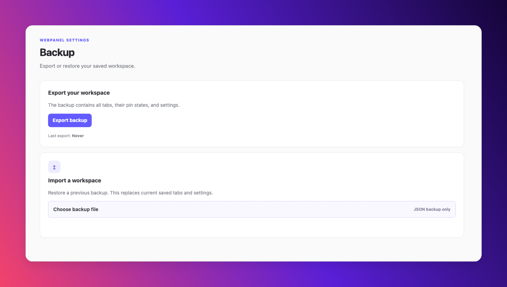

# WebPanel

**Keep your most-used websites in Chrome's native side panel.** WebPanel gives each site a named, persistent tab, so your tools stay close without taking over the current page.

## Highlights

- Persistent website tabs, saved locally in Chrome
- Named tabs with pinning, duplication, editing, refresh, and multi-select actions
- A configurable home page and optional address bar
- Right-click any link or selected text to open it in WebPanel
- Light, dark, and system themes
- Settings backup and restore

| Add a focused workspace | Customize the experience |
| --- | --- |
|  |  |

## Install locally

1. Download or clone this repository.
2. Open `chrome://extensions` in Google Chrome.
3. Enable **Developer mode**.
4. Click **Load unpacked** and select this project folder.
5. Click the WebPanel toolbar icon to open its side panel.

After pulling an update, click the extension's **Reload** button on `chrome://extensions` before testing it.

## Use WebPanel

1. Click **+** to add a website, then give it a useful name.
2. Right-click a panel tab to edit, duplicate, pin, refresh, or remove it.
3. Right-click a link or selected text on a webpage and choose **Open link in WebPanel** or **Search in WebPanel**.
4. Open the extension's **Settings** from its toolbar-icon context menu to change the home page, layout, theme, and backup options.

## Website compatibility

WebPanel can load any HTTP/HTTPS address that permits being displayed in a frame. Version 1.0.1 allows websites from any HTTP/HTTPS origin; the prior build accidentally allowed only Google Docs, which caused Chrome's “This content is blocked” message for normal sites.

Some sites—including Google Gemini and many banking, authentication, and social services—intentionally send `X-Frame-Options` or `Content-Security-Policy: frame-ancestors` headers that prevent *all* embedded views. WebPanel respects those protections and cannot override them; open those sites in a normal Chrome tab instead.

## Privacy

WebPanel saves its tab list and preferences in `chrome.storage.local`. Review the included [privacy policy](privacy.html) before publishing. The extension does not inject scripts into the websites you open or bypass a site's security policy.

## Chrome Web Store checklist

- Host the [privacy policy](privacy.html) at a public URL before submission.
- Complete the Chrome Web Store data-use disclosure and declare the extension permissions.
- Add current screenshots, a support email, and a concise store description.
- Package extension source files only; exclude `.DS_Store` and Chrome-generated `_metadata/` files.
